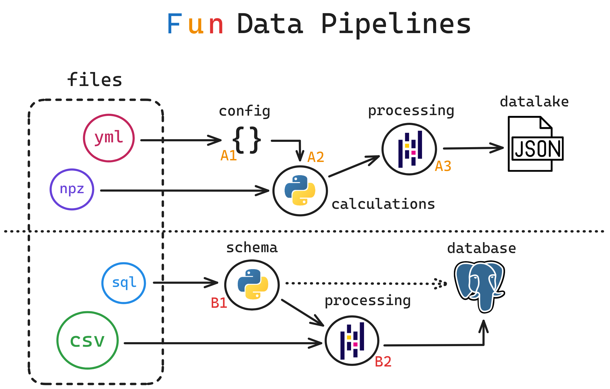

# lighthouse-pipelines-challenge

## Detalhamento do Problema

Neste desafio, os participantes devem criar duas pipelines para o tratamento e manipulação de dados de precificação de combustível disponibilizados na pasta `archives`, utilizando os recursos aqui disponibilizados.

A primeira pipeline (A) deve ser construída de modo a ler o arquivo de configuração `config.yml` que contém parâmetros de consulta desejados, e processar os dados disponíveis em `raw.npz`. O resultado final deve ser um arquivo que contém todos os dados filtrados a partir dos parâmetros utilizados, um arquivo que contém apenas dados estátisticos (média, mediana, desvio padrão) dos preços dentro dos parâmetros passados.

A segunda pipeline (B) deve ser construída de modo a ler o arquivo de *schema* `schema.sql` que contém o DDL para a criação de tabelas no banco de dados, e processar os dados disponíveis nos arquivos `.csv` na pasta `data`. Como resultado final, as tabelas do banco de dados devem estar corretamente criadas e populadas de acordo com cada arquivo. Como adicional, uma tabela de detalhamento `pricing_information` que agregue os dados utilizando *python*, apresentando todas as colunas de todas as tabelas em conjunto (exceto *ids*). A criação dessa tabela deve ser feita através de um arquivo de *schema* criado pelo participante, seguindo o mesmo padrão apresentado em `schema.sql`.

Todos os arquivos finais devem ser salvos na pasta `target`, dentro de `archives`.



Os dados foram obtidos e previamente tratados a partir da fonte *4 ultimas semanas gasolina etanol*, disponível em [dados.gov.br](https://dados.gov.br/dados/conjuntos-dados/serie-historica-de-precos-de-combustiveis-e-de-glp).


## Configuração de Ambiente

Inicialmente, configure seu ambiente, criando a `virtualenv` e instalando os requisitos utilizando o arquivo `requirements.txt`.
A partir disso, uma vez dentro da **venv**, utilize os seguintes comandos para inicializar o banco de dados:
```bash
source config.sh
docker compose up -d
```
E para encerrar a execução do banco de dados:
```bash
docker compose down
```
Se deseja apagar todos os dados do banco de dados:
```bash
sudo rm -R database
```
A execução do banco de dados exige a instalação do [docker](https://www.docker.com/get-started/) e [docker-compose](https://docs.docker.com/compose/). É recomendado que se use a ferramenta [dbeaver](https://dbeaver.io/) para a visualização dos dados.
